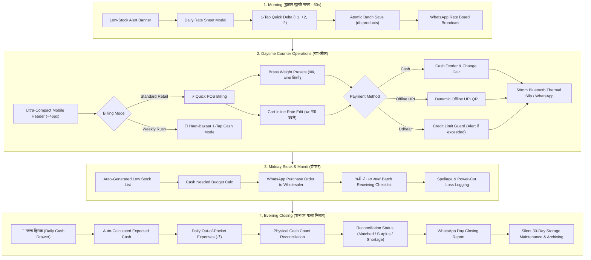

# Gramin Kirana — Operational Workflow, Technical Architecture & Maintenance Guide

> **Document Purpose:** Comprehensive technical reference, operational lifecycle guide, and enhancement roadmap for the Gramin Kirana (ग्रामीण किराना) platform. Designed for engineers, maintainers, and product designers to ensure architectural consistency, zero-regression bug fixes, and seamless future scalability.

---

## 1. Complete Daily Operational Lifecycle (दिनभर का कार्यप्रवाह)



---

## 2. Technical Architecture & Data Layers

### 2.1 Storage Architecture (IndexedDB / Dexie.js)
Gramin Kirana is built strictly **Offline-First**. The client device is the primary source of truth, backed by IndexedDB via Dexie.js (`src/db/index.ts`):

| Table | Entity Interface | Key Responsibilities & Indexing |
| :--- | :--- | :--- |
| `db.products` | `Product` | Product master, barcodes, stock counts, wholesale (`purchasePrice`), and retail (`sellingPrice`). Indexed on `id`, `name`, `category`, `barcode`. |
| `db.customers` | `Customer` | Customer accounts, running `balanceDue`, credit limit `creditLimit`, repayment schedule dates (`dueDate`, `dueReason`), and village neighborhood (`para`). |
| `db.sales` | `Sale` | Completed transactions, itemized line items with exact applied `unitPrice` and `total`, timestamp, and discount breakdown. |
| `db.transactions`| `Transaction`| ACID-synchronized Bahi-Khata ledger entries (`UDHAAR` / `JAMA`), balance updates, and transaction note summaries. |
| `db.dailyCashCloses`| `DailyCashClose`| Historical evening till reconciliations, cash sales, recovered debt, categorized expenses, and surplus/deficit flags. |
| `db.spoilageLogs`| `SpoilageLog` | Quantified inventory wastage due to load-shedding, heat, pests, or distributor expiry. Auto-adjusts `db.products.stockQty`. |

### 2.2 Dynamic Market Rate Flow (Rate Adjustment System)
To handle fluctuating agricultural commodity prices without inventory exits, rates flow across three synchronized touchpoints:

```
[Mandi Restock / Town Market]
          │
          ▼
1. Daily Rate Sheet Modal (src/components/Mandi/DailyRateSheetModal.tsx)
   - Curated staple filter (isLoose, staples, pulses, oils, spices, kg/liter)
   - Quick increment chips (-5, -2, -1, +1, +2, +5)
   - Margin Guard: Flags rate < wholesale purchasePrice
   - Atomic batch update via db.transaction('rw', db.products)
          │
          ├─────────────────────────────────────────┐
          ▼                                         ▼
2. Loose Weighing Modal (POS)            3. Inline Cart Item Editor (POS)
   - "🏷️ आज का भाव" per unit              - "✏️ भाव बदलें" on any cart item
   - Checkbox: Save new rate to catalog   - "नया भाव" visual badge
   - Adds to cart with customRate         - Checkbox: Save new rate to catalog
          │                                         │
          └────────────────────┬────────────────────┘
                               ▼
            4. CartItem { customRate?: number, calculatedPrice }
                               │
                               ▼
            5. Checkout & Atomic ACID Finalization
               - db.sales: records unitPrice = item.customRate ?? item.product.sellingPrice
               - db.transactions: notes include custom rate (@₹XX)
               - Thermal Print Slip & WhatsApp text carry applied unit rates
```

---

## 3. Component & Navigation Hierarchy

```
App.tsx (LanguageProvider, Auth, Active Tab Routing, MoreMenuSheet)
 │
 ├── Header.tsx
 │    ├── [Mobile <768px]: Ultra-Compact Single Row (~46px)
 │    │    └── Store Name, Online Dot, Voice Mic, Language Toggle, Store Action Sheet Drawer
 │    └── [Desktop >=768px]: Full Identity Bar + Desktop Tabs Navigation Matrix
 │
 ├── QuickBilling.tsx (⚡ POS)
 │    ├── Category Matrix (Alt+1..9 shortcuts, zero horizontal scroll)
 │    ├── Camera Barcode Scanner Modal (BarcodeScannerModal.tsx)
 │    ├── Loose Weight Selector Modal (Brass weights + today's rate input)
 │    ├── Interactive Cart (Inline rate editing, round-off chips, credit limit guard)
 │    ├── Dynamic Offline UPI QR Modal (phonepe/gpay locally rendered SVG)
 │    └── Completed Bill Dialog (Bluetooth thermal printing & WhatsApp formatter)
 │
 ├── HaatBazaarMode.tsx (🎪 साप्ताहिक हाट)
 │    ├── Top 12 Extra-Large Touch Tiles
 │    ├── Quick Tender Chips (बराबर, ₹50, ₹100, ₹200, ₹500)
 │    └── 1-Tap Cash Checkout & Live Till Meter
 │
 ├── KhataLedger.tsx (📒 बही-खाता)
 │    ├── Para/Mohalla grouping & search
 │    ├── Jama (+) & Udhaar (-) single-tap accounting
 │    └── WhatsApp Payment Reminder Generator
 │
 ├── MandiPlanner.tsx (🛒 मंडी खरीदारी)
 │    ├── 🌅 Daily Rate Sheet Modal Trigger (DailyRateSheetModal.tsx)
 │    ├── Auto-calculated low-stock budget
 │    ├── Wholesaler purchase order formatter
 │    └── "मंडी से माल आया" bulk receiving checklist
 │
 ├── AllStock.tsx (📦 स्टॉक मास्टर)
 │    ├── 🌅 Daily Rate Sheet Modal Trigger
 │    ├── Search, category filters, and quick price revision buttons (+1, +2, -1)
 │    └── Add/Edit product modals with barcode duplicate guard
 │
 ├── DailyCashClose.tsx (🏦 गल्ला हिसाब)
 │    ├── Evening cash reconciliation
 │    ├── Expense chips (सवारी/भाड़ा, मजदूरी, चाय/नाश्ता, बिजली)
 │    ├── Historical slips archive
 │    └── 30-Day auto storage maintenance trigger
 │
 └── SpoilageExpiryGuard.tsx (⚠️ खराबी सुरक्षा)
      └── Load-shedding loss logger & stock deduction sync
```

---

## 4. Maintenance & Bug-Fix Verification Checklist

Whenever modifying features, bug fixes, or routes, verify against this strict checklist derived from `AGENTS.md`:

- [ ] **Multi-Tenant Isolation (Rule 8):** Verify all database and server queries include explicit `tenantId` filtering (`{ tenantId: req.user.tenantId, ... }`).
- [ ] **Role Privacy Masking (Rule 10):** Verify cashier/Munim sessions never expose wholesale `purchasePrice` or profit margin percentages in UI tables or network payloads.
- [ ] **ACID Transaction Wrapping (Rule 7):** When writing to multiple collections (e.g. `sales`, `customers`, `transactions`, `products`), wrap operations inside Dexie ACID transactions:
  ```typescript
  await db.transaction('rw', [db.sales, db.customers, db.transactions, db.products], async () => { ... });
  ```
- [ ] **Rate Persistence Consistency (Rule 7):** Verify that when `customRate` is applied, it persists to:
  1. `CartItem.calculatedPrice`
  2. `Sale.items[].unitPrice`
  3. `Transaction.billItemsSummary`
  4. 58mm Thermal Printer payload
  5. WhatsApp message string
- [ ] **Responsiveness & Touch Targets (Rule 13):**
  - Mobile (320px–480px): Single-line 46px header, zero horizontal overflow, bottom sticky drawer, large thumb buttons (min 44x44px).
  - Tablet (768px–1024px): Dual-column split view.
  - Desktop (1280px+): Catalog on left, sticky billing pad on right.
- [ ] **Synchronous Documentation (Rules 6 & 11):** Any user-facing change must be immediately documented in `docs/USER_MANUAL.md` with updated Table of Contents, maintaining strictly non-technical phrasing.
- [ ] **Zero Build Errors:** Must pass both `npm run build` (client Vite+TS) and `npm --prefix server run build` (Node.js TS).

---

## 5. Future Enhancement Roadmap

### 5.1 Automated Morning Mandi Rates Feed (e-NAM / Agmarknet)
- **Concept:** Server-side background cron running once daily at 6:00 PM to fetch district mandi prices from `api.data.gov.in` (Agmarknet) or public e-NAM feeds.
- **Client Cache:** Downloaded to client IndexedDB on first morning connect.
- **Rate Sheet Pre-Fill:** Pre-fills the "🌅 आज का भाव शीट" with government APMC benchmark rates so the store owner can accept or tweak with 1 click.

### 5.2 Customer Digital Khata Passbook (Read-Only Village Portal)
- **Concept:** Secure, read-only WhatsApp link generated for customers (e.g. `gramin-kirana.in/khata?id=...&token=...`).
- **Feature:** Villagers can view their own itemized passbook, repayments, and outstanding balance from their own mobile phones in Hindi/Chhattisgarhi.

### 5.3 Direct Bluetooth Electronic Weighing Scale Integration
- **Concept:** Support Web Bluetooth / Web Serial API to read weights automatically from electronic counter scales (10kg/30kg commercial scales).
- **Feature:** Eliminates manual weight entry for loose potatoes, onions, sugar, and grains.

### 5.4 Multi-Counter Local Mesh Sync (Offline Multi-Device)
- **Concept:** When multiple counter staff share a shop without internet, synchronize bills and stock in real time across the shop's local Wi-Fi / Hotspot using lightweight WebRTC or local WebSocket broadcasting.

